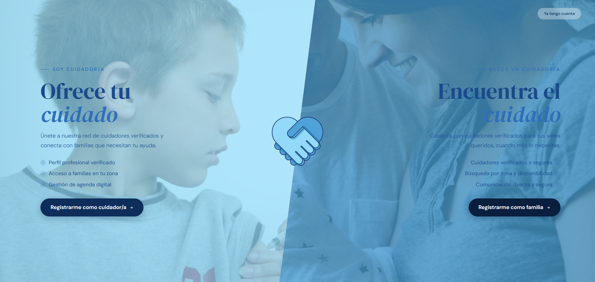

# TQIDO

**TQIDO** es una plataforma web que conecta a **cuidadores** (*carers*) con **clientes** (*customers*) que buscan servicios de cuidado —de adultos mayores, niños o mascotas—, permitiendo publicar servicios, consultar disponibilidad, reservar citas y gestionar todo el ciclo de una reserva de principio a fin.

Construida sobre **Laravel 12** con **Inertia.js** y **React 19** (TypeScript), siguiendo el *React Starter Kit* oficial de Laravel.


<p align="center">
  
</p>
<p align="center">
  
  
</p>

---

## Tabla de contenido

- [Características](#características)
- [Arquitectura](#arquitectura)
- [Stack tecnológico](#stack-tecnológico)
- [Modelo de dominio](#modelo-de-dominio)
- [Puesta en marcha](#puesta-en-marcha)
- [Variables de entorno](#variables-de-entorno)
- [Autenticación](#autenticación)
- [Reglas de negocio de las reservas](#reglas-de-negocio-de-las-reservas)
- [Rutas principales](#rutas-principales)
- [Estructura del proyecto](#estructura-del-proyecto)
- [Testing y calidad de código](#testing-y-calidad-de-código)

---

## Características

- 👥 **Doble rol de usuario**: `carer` (cuidador) y `customer` (cliente), con paneles, rutas y middleware diferenciados.
- 🔐 **Autenticación completa**: registro, login, verificación de correo, 2FA (Laravel Fortify) y login social con Google (Laravel Socialite), incluyendo el flujo para completar el registro cuando un usuario social aún no tiene rol asignado.
- 🧾 **Perfiles enriquecidos**: datos personales, direcciones múltiples, disponibilidad semanal configurable, perfiles de cuidado (para quién se solicita el servicio) y hasta 3 servicios ofrecidos por cuidador, cada uno con precio y ofertas.
- 📊 **Porcentaje de completitud de perfil**, calculado dinámicamente según el rol del usuario y los campos/relaciones que aún faltan por completar.
- 📅 **Sistema de reservas (`Reserva`)** con máquina de estados completa: `pendiente → aceptada/rechazada → en_curso → completada`, o `cancelada` en cualquier punto anterior a su ejecución.
- ✅ **Validación de disponibilidad real**: una reserva solo se crea si coincide con un bloque de disponibilidad del cuidador, respeta la duración mínima configurada y el aviso previo requerido, y no genera solapamientos ni para el cuidador ni para el cliente.
- 💰 **Cálculo automático de precios**: aplica el precio de oferta si está activo, y calcula el precio total en función de la duración de la reserva.
- 🎛️ **Paneles de administración de reservas**: el cuidador puede aceptar, rechazar, iniciar y completar solicitudes; el cliente puede crear y cancelar reservas.
- 🖥️ **Frontend SPA-like con Inertia + React**: páginas para landing, autenticación, dashboards por rol, perfil privado y perfil público del cuidador, componentes UI basados en Radix + Tailwind, animaciones (Framer Motion / GSAP) y modo SSR opcional.

## Arquitectura

```
Cliente (navegador)
        │  Inertia (JSON + navegación SPA)
        ▼
routes/web.php ──► Controllers (Auth, Carer, Customer, Bookings, Social)
        │                              │
        │                              ▼
        │                         Eloquent Models (User, Profile, Reserva, ...)
        ▼
resources/js/features/*  (páginas React por dominio: auth, dashboard, profile, landing_page)
```

- **Backend**: Laravel 12 con controladores tradicionales (no API-only): las páginas se renderizan vía `Inertia::render(...)` y los formularios se envían como requests normales o AJAX, según el contexto.
- **Autorización por rol**: middleware `role:carer` / `role:customer` (alias `EnsureUserHasRole`) protege rutas completas de dashboard y perfil; los controladores de reservas además validan la pertenencia del recurso al usuario autenticado.
- **API interna** (`routes/api.php`): endpoints JSON usados por flujos específicos (login por API, alta/edición de perfil, activación de servicios, logout con Sanctum).
- **Frontend por features**: cada dominio (`auth`, `dashboard/carer`, `dashboard/customer`, `profile/carer`, `profile/costumer`, `profile_public`, `landing_page`) contiene sus propias páginas y layouts.

## Stack tecnológico

| Categoría              | Tecnología                                                        |
|-------------------------|---------------------------------------------------------------------|
| Backend                  | Laravel 12 (PHP 8.2+)                                                 |
| Renderizado              | Inertia.js 2 (SSR opcional)                                             |
| Frontend                 | React 19 + TypeScript, Vite 7                                             |
| Estilos                  | Tailwind CSS 4, `tailwind-merge`, `tw-animate-css`                          |
| Componentes UI           | Radix UI, shadcn-style components, Lucide icons                              |
| Animaciones              | Framer Motion, GSAP, Lenis (smooth scroll), Swiper, Embla Carousel              |
| Autenticación            | Laravel Fortify (2FA), Laravel Socialite (Google), Laravel Sanctum (tokens API) |
| Base de datos            | SQLite por defecto (configurable a MySQL/PostgreSQL)                              |
| Calidad de código        | ESLint, Prettier (+ plugins de Tailwind y organize-imports), Laravel Pint, PHPUnit |

## Modelo de dominio

**`User`**
- Roles `carer` / `customer` (con fallback heurístico basado en el campo legado `specialty`).
- Soporta 2FA (Fortify) y login social (`provider`, `provider_id`).
- Relación `hasOne` con `Profile`, y `hasMany` con `Reserva` tanto como cliente (`customerReservas`) como cuidador (`carerReservas`).

**`Profile`**
- Datos generales: DNI, fecha de nacimiento, dirección, ciudad, idiomas, descripción, documentos (DNI frontal/trasero, certificados).
- Relaciones: `direcciones` (múltiples direcciones), `cuidados` (perfiles de cuidado, es decir, para quién se solicita/ofrece el servicio), `disponibilidades` (bloques semanales) y `servicios` (ofertas del cuidador).
- `getCompletionPercentage()`: calcula el % de perfil completado y los campos/relaciones faltantes, con reglas distintas para `carer` y `customer`.

**`DireccionesPerfil`**, **`DisponibilidadPerfil`**, **`PerfilesCuidado`**, **`ServicioPerfil`**
- Entidades hijas de `Profile` (relación `belongsTo`), cada una representando una sub-sección editable del perfil.
- `ServicioPerfil` admite hasta 3 tipos por cuidador (`adultos_mayores`, `ninos`, `mascotas`), con `precio_hora`, `precio_oferta` y bandera `oferta_activa`.

**`Reserva`**
- Relaciona `customer_user_id`, `carer_user_id`, `carer_profile_id` y `servicio_perfil_id`.
- Estados: `pendiente`, `aceptada`, `rechazada`, `cancelada`, `en_curso`, `completada` (constantes `ESTADO_*`).
- Guarda fecha/hora de servicio, duración, dirección, precio por hora y total, y marcas de tiempo de cada transición (`respondida_en`, `iniciada_en`, `completada_en`, `cancelada_en`).

## Puesta en marcha

### Requisitos previos

- PHP 8.2+
- Composer
- Node.js 18+ y npm
- SQLite (por defecto) o el motor de base de datos que configures

### Instalación rápida

El propio `composer.json` define un script `setup` que automatiza todo el proceso:

```bash
git clone https://github.com/N4him/TQIDO.git
cd TQIDO
git checkout master   # el desarrollo activo vive en esta rama

composer run setup
```

Esto instala dependencias PHP y JS, copia `.env.example` a `.env`, genera la `APP_KEY`, ejecuta las migraciones y compila los assets.

### Instalación manual

```bash
composer install
cp .env.example .env
php artisan key:generate

npm install

touch database/database.sqlite   # si usas SQLite (por defecto)
php artisan migrate
```

### Ejecución en desarrollo

```bash
composer run dev
```

Este comando levanta en paralelo: servidor de Laravel (`php artisan serve`), el *queue worker* (`php artisan queue:listen`) y Vite (`npm run dev`).

Alternativa con SSR:

```bash
composer run dev:ssr
```

> **Nota:** el repositorio tiene dos ramas — `Develop` (rama por defecto, prácticamente vacía) y `master`, donde vive el código de la aplicación. Asegúrate de trabajar sobre `master`.

## Variables de entorno

Además de las variables estándar de Laravel (`APP_*`, `DB_*`, `SESSION_*`, `MAIL_*`), este proyecto utiliza:

| Variable                | Descripción                                  |
|--------------------------|-------------------------------------------------|
| `GOOGLE_CLIENT_ID`       | Client ID de OAuth para login social con Google    |
| `GOOGLE_CLIENT_SECRET`   | Client secret de OAuth con Google                     |
| `GOOGLE_REDIRECT_URI`    | URL de callback (`/auth/google/callback`)                |

Otros proveedores (`FACEBOOK_*`, `APPLE_*`) están definidos en `config/services.php` aunque no implementados actualmente en `SocialController` (solo `google` está habilitado).

## Autenticación

TQIDO combina tres mecanismos:

1. **Sesión web (Fortify + Inertia)**: login/registro tradicionales con validaciones detalladas en español y soporte de 2FA.
2. **API JSON** (`routes/api.php`): endpoints equivalentes para clientes que consuman la app vía JSON (login, creación/edición de perfil, activar servicios, logout con revocación de token Sanctum).
3. **Login social con Google**: flujo OAuth que:
   - Si el usuario social ya existe, inicia sesión directamente.
   - Si el correo ya está registrado, vincula la cuenta social.
   - Si es un usuario nuevo sin rol elegido, lo redirige a completar el registro (`/register/social/{role}`) para asignarle `carer` o `customer`.

## Reglas de negocio de las reservas

Al crear una reserva (`CustomerBookingController::store`), el sistema valida en orden:

1. El cliente tiene un perfil completo.
2. El perfil del cuidador y el servicio solicitado existen, pertenecen al cuidador y están activos.
3. La fecha/hora solicitada es futura.
4. La franja solicitada **cabe dentro de un bloque de disponibilidad** del cuidador para ese día de la semana.
5. Se respeta la **duración mínima** y el **aviso previo en horas** configurados en ese bloque de disponibilidad.
6. No existe **solapamiento** con otra reserva activa (`pendiente`, `aceptada`, `en_curso`) ni para el cuidador ni para el cliente.

Solo entonces se calcula el precio (usando el de oferta si está activo) y se crea el registro en estado `pendiente`, a la espera de que el cuidador la acepte o rechace.

## Rutas principales

### Públicas
| Ruta | Descripción |
|------|-------------|
| `GET /` | Landing page |
| `GET /login`, `POST /login` | Inicio de sesión |
| `GET /register`, `POST /register` | Registro general |
| `GET /register/customer`, `GET /register/carer` | Registro específico por rol |
| `GET /auth/{provider}`, `GET /auth/{provider}/callback` | OAuth social (Google) |

### Dashboard cuidador (`role:carer`)
| Ruta | Descripción |
|------|-------------|
| `GET /dashboard/carer` | Resumen del cuidador |
| `GET /dashboard/carer/agenda` | Agenda de servicios |
| `GET /dashboard/carer/clientes` | Clientes atendidos |
| `GET /dashboard/carer/solicitudes` | Listado de solicitudes de reserva |
| `PATCH .../solicitudes/{reserva}/aceptar\|rechazar\|iniciar\|completar` | Transiciones de estado de una reserva |

### Dashboard cliente (`role:customer`)
| Ruta | Descripción |
|------|-------------|
| `GET /dashboard/customer` | Resumen del cliente |
| `GET /dashboard/customer/reservas` | Historial de reservas |
| `GET /dashboard/customer/favoritos` | Cuidadores favoritos |
| `POST /dashboard/customer/reservas` | Crear una reserva |
| `PATCH .../reservas/{reserva}/cancelar` | Cancelar una reserva |

### API (`routes/api.php`)
| Método | Endpoint | Descripción |
|--------|----------|-------------|
| POST | `/api/login` | Login vía JSON |
| POST | `/api/create-profile` | Crear perfil |
| PUT  | `/api/update-profile` | Actualizar perfil (datos, direcciones, disponibilidad, servicios) |
| POST | `/api/apply` | Activar/desactivar servicios completos del perfil |
| POST | `/api/logout` | Cerrar sesión (revoca token Sanctum) |

## Estructura del proyecto

```
TQIDO/
├── app/
│   ├── Actions/Fortify/        # Personalización de registro/reset de password
│   ├── Http/
│   │   ├── Controllers/         # Auth, Carer, Customer, Bookings, Social, Settings
│   │   ├── Middleware/           # Roles, apariencia, Inertia
│   │   └── Requests/               # Form requests de configuración
│   ├── Models/                       # User, Profile, Reserva, ServicioPerfil, ...
│   └── Providers/                       # AppServiceProvider, FortifyServiceProvider
├── database/
│   ├── migrations/                       # Esquema completo (usuarios, perfiles, reservas, 2FA, tokens)
│   └── seeders/
├── resources/js/
│   ├── components/                        # Componentes UI compartidos (Radix + shadcn-style)
│   ├── features/
│   │   ├── auth/                            # Login, registro
│   │   ├── dashboard/carer|customer/           # Paneles por rol
│   │   ├── profile/carer|costumer/              # Edición de perfil por rol
│   │   ├── profile_public/                        # Perfil público del cuidador
│   │   └── landing_page/                            # Página de inicio
│   ├── hooks/                                          # Hooks de UI (apariencia, 2FA, mobile, etc.)
│   └── layouts/ (dentro de features)                     # Layouts específicos por rol
├── routes/            # web.php, api.php, settings.php, console.php
├── tests/             # Feature y Unit tests (PHPUnit)
└── composer.json / package.json
```

## Testing y calidad de código

```bash
# Backend
composer run test          # limpia config y ejecuta php artisan test

# Frontend
npm run lint                 # ESLint
npm run format                # Prettier
npm run types                  # Chequeo de tipos con tsc --noEmit
```

Los tests de backend (`tests/Feature`) cubren autenticación, verificación de correo, reseteo/confirmación de contraseña, 2FA y el dashboard base, usando PHPUnit sobre el kit de Laravel.

---

Proyecto desarrollado como plataforma de intermediación de servicios de cuidado (TQIDO).
